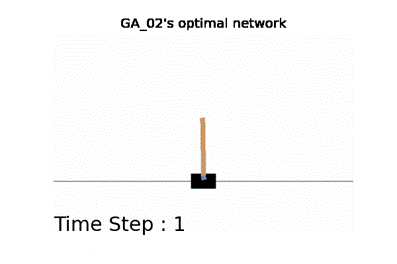
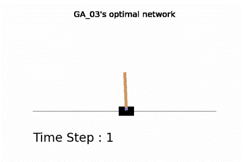
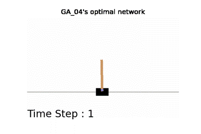
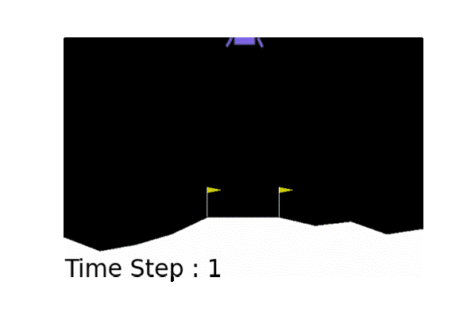

# Mathematics-2022

> Optimal Agent Search Using Surrogate-assisted Genetic Algorithms

The experimental codes using SGAs from the paper that was submitted to [Mathematics](https://www.mdpi.com/journal/mathematics).

## Environments

- Ubuntu 18.04 LTS

- Python 3.7.11

## Simulations

> Cart-pole Balancing

- SVR *step 1*

- SVR *step 2*

- SVR *step 3*

> Lunar Lander

- SVR *step 3*

